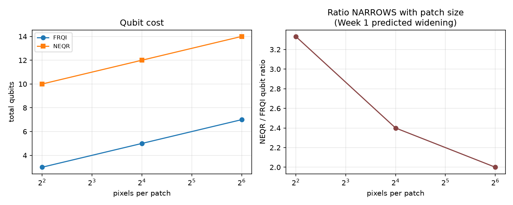
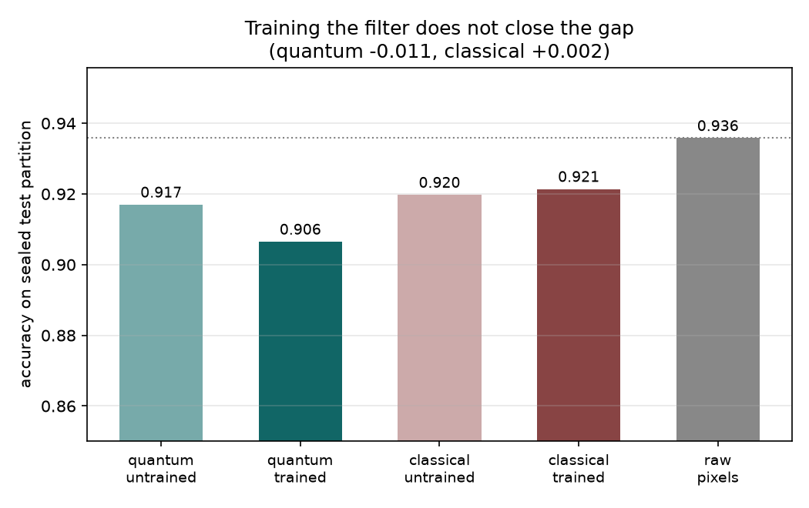
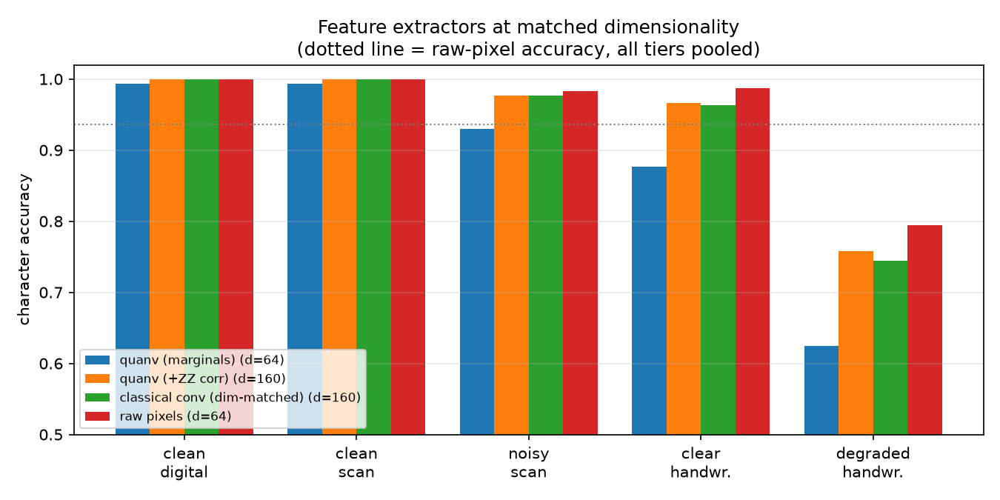
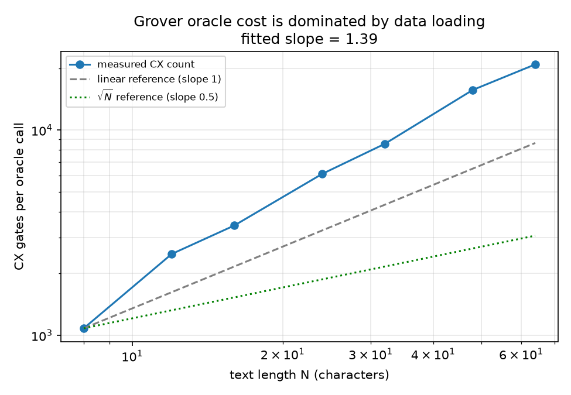
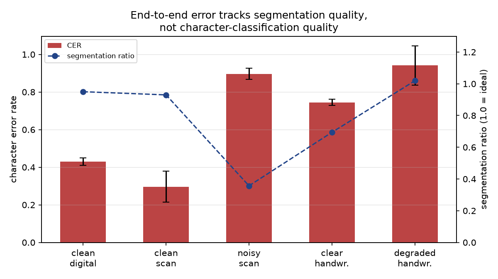
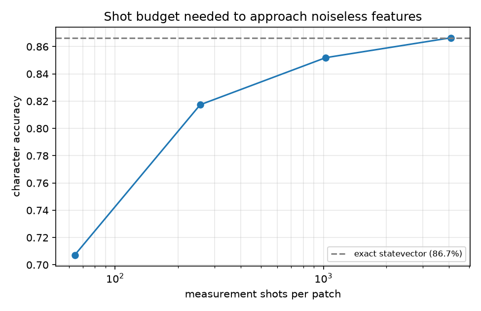

# Lean Quantum Document Pipeline — Final Report

**QIntern 2026 | QWorld**
**Project:** Hybrid QML and Quantum String Algorithms for Efficient Document Extraction and Processing
**Mentor:** Potluri Krishna Priyatham
**Repository:** github.com/Pushkar0997/qi26_25

> **Status: complete (Aug 13, 2026).** Every number in this report is measured
> and reproducible via the commands in §11 — none are estimated. Figures are
> generated from the committed results files, so they cannot disagree with the
> tables. All results come from the Windows reference run (Arial / Times New
> Roman Italic, seed 26); `manifest.json` records the exact fonts and platform,
> since glyph rendering shifts absolute accuracy by a fraction of a percent
> between operating systems. Comparative conclusions were checked on two
> platforms and are unchanged.

---

## 1. Objective and what was actually built

The brief asked for a resource-efficient document intelligence pipeline that
replaces parts of a classical LLM-based approach with quantum components, and
for a quantitative comparison against classical baselines.

What was built:

```
document image
   └─> projection-profile segmentation           (classical front end)
        └─> 8x8 character crops
             └─> RY angle encoding -> quanvolutional layer   (QUANTUM, Track A)
                  └─> 64- or 160-dim feature vector
                       └─> multinomial logistic regression   (lightweight classical backend)
                            └─> extracted text
                                 └─> document ID field
                                      └─> Grover comparator oracle   (QUANTUM, Track B)
                                           └─> pattern position
```

Both quantum stages are genuine: the quanvolutional layer is a simulated
entangling circuit whose output is verified against Qiskit Aer, and the Grover
oracle computes string comparison inside the circuit rather than being handed
the answer.

---

## 2. Dataset

60 documents across five quality tiers, 12 per tier, yielding **6,023 labelled
character crops**. Generated by `data/generate_dataset.py`, deterministic under
seed 26.

Every tier renders the *same distribution of source text*, so accuracy
differences between tiers are attributable to image degradation alone rather
than to content difficulty. Degradation is applied as a controlled variable:
blur, sensor noise, contrast reduction, low-DPI resampling, rotation, and
blotch artifacts, with per-tier parameters recorded in the generator.

| Tier | Median per-crop dynamic range |
|---|---|
| clean_digital | 197 |
| clean_scan | 182 |
| clear_handwriting | 153 |
| noisy_scan | 82 |
| degraded_handwriting | 62 |

*(Dynamic-range figures above were measured on the Linux reference rendering.
Re-measure on your platform before submission — see §11.)*

The monotone fall in dynamic range confirms the tiers form a genuine difficulty
gradient rather than five arbitrary noise settings.

**Honest limitations.** (a) The data is synthetic; ground-truth labels are exact,
but the degradation model is our own rather than sampled from real scanner
behaviour. (b) The "handwriting" tiers use an italic font with per-glyph
position, rotation and scale jitter as a proxy for handwriting variability —
they are not real handwriting. The IAM Handwriting Database is the correct
extension and is named here rather than quietly omitted.

---

## 3. Track A — Encoding and quantum feature extraction

### 3.1 FRQI vs NEQR

At 2×2 (4 pixels), verified by simulation: NEQR reconstructs pixel values
exactly; FRQI reconstructs approximately (error ~1–2 levels out of 255 at 8192
shots), at 3 qubits versus 10 and roughly 2.5× fewer CX gates.

Measured across three patch sizes (`track_a_vision/encoding/encoding_scaling.py`):

| Patch | Pixels | FRQI qubits / depth / CX | NEQR qubits / depth / CX | Qubit ratio |
|---|---|---|---|---|
| 2×2 | 4 | 3 / 49 / 32 | 10 / 194 / 114 | 3.33× |
| 4×4 | 16 | 5 / 515 / 384 | 12 / 2,955 / 1,558 | 2.40× |
| 8×8 | 64 | 7 / 4,107 / 3,584 | 14 / 20,882 / 10,998 | 2.00× |

**The Week 1 hypothesis is refuted.** That summary predicted the qubit gap would
"widen, not shrink" as patches grow. Measured, the ratio *narrows*: 3.33× → 2.40×
→ 2.00×.

The original reasoning conflated two different costs. FRQI's colour register is
fixed at 1 qubit and NEQR's at 8, so the colour gap is a *constant* 7 qubits at
every patch size — while both encodings share an identically growing position
register of ⌈log₂(pixels)⌉. A constant gap divided by a growing shared base
necessarily shrinks as a ratio. Absolute CX counts do grow steeply for both
(NEQR reaching ~11,000 at 8×8), so NEQR remains far more expensive in absolute
terms; it is specifically the *relative* qubit penalty that decays.

Practical consequence for the pipeline: NEQR's exactness becomes progressively
cheaper to buy at larger patch sizes, which strengthens rather than weakens the
Week 1 recommendation to prefer NEQR for OCR — but for the opposite reason to
the one originally given.



### 3.2 Quanvolutional layer

A fixed 4-qubit entangling circuit (2 layers of RY rotations plus ring CX) is
applied to each 2×2 patch of an 8×8 character crop, stride 2, giving 16 patches
per character.

**Simulation cost note.** Running one Aer job per patch means ~96,000 jobs to
process the dataset, which made iteration impossible. Because the filter is
fixed, its unitary is extracted once and applied to all patches as a batched
numpy matrix multiply. This is the same linear algebra, not an approximation:
`features.verify_against_qiskit()` measures maximum deviation from the
shot-based implementation at **0.0028** (within sampling error at 200k shots).
Processing time fell from hours to **0.15 s for 2,000 characters**.

### 3.3 Readout matters more than expected

The obvious readout — per-qubit P(measure 1) — discards everything the
entangling layer produces, since a 4-qubit filter yields a 16-outcome
distribution and only 4 marginals are kept. Adding pairwise ⟨Z_i Z_j⟩
correlations recovers most of the lost signal:

| Readout | Feature dim | Accuracy (all tiers) |
|---|---|---|
| Marginals only | 64 | 86.7% |
| Marginals + ⟨Z_i Z_j⟩ | 160 | 92.2% |

---

## 4. Track B — Grover string matching

### 4.1 Why the starter oracle was replaced

`grover_string_match_starter.ipynb` computes match positions classically and
then builds an oracle that flips the phase of those positions. That
demonstrates Grover *amplification* correctly, but it is not string matching:
the circuit is told the answer. No complexity claim can rest on it.

`comparator_oracle.py` is given only the text and the pattern. It loads
text[i:i+M] into a window register conditioned on the position register in
superposition, XORs the pattern in, phase-marks the all-zero (matching) case,
then uncomputes to disentangle the window.

### 4.2 Verification

Staged, mirroring the FRQI/NEQR verification approach:

| Stage | Check | Result |
|---|---|---|
| 1. Windowing | window register holds text[i:i+M] for a probe position | pass |
| 2. Phase marking | exactly the true match positions have negative amplitude | pass |
| 3. Uncomputation | amplitude leakage outside the window==0 block | **0.0** |
| 4. Full search | measured position is a true match | pass, 95–96% confidence |

On a 16-character hex field with a 2-character pattern: 14 qubits, 3 Grover
iterations, correct position recovered with 95.2% of shots.

### 4.3 The complexity result — stated honestly

Grover gives O(√N) *queries*. But the window-loading stage must write the text
into the circuit, and each candidate position requires its own controlled load.
Measured CX count against text length:

| N (chars) | qubits | depth | CX |
|---|---|---|---|
| 8 | 13 | 1,857 | 1,082 |
| 16 | 14 | 6,383 | 3,428 |
| 32 | 15 | 16,159 | 8,570 |
| 64 | 16 | 39,558 | 20,904 |

**Fitted CX scaling exponent: 1.39** — superlinear in N, because the number of
loads grows with N while each multi-controlled gate also grows with the widening
position register.

**Conclusion:** for searching stored, unstructured classical text that we must
load ourselves, the quadratic query advantage does not survive into an
end-to-end speedup. The data-loading cost dominates. Grover's advantage here is
real only where the text is already available as a quantum oracle or QRAM, or is
generated by a function rather than stored. This is a well-known caveat and our
measurements reproduce it directly rather than quoting √N unqualified.

A second practical constraint: a full 38-symbol alphabet needs 6 qubits per
character, which pushes even a short window past the ~27-qubit simulation
ceiling. The search stage therefore operates on the hex-representable ID field
(5 qubits/char), which is the realistic target for structured-identifier lookup
anyway.

---

## 5. Benchmarking — the central comparison

All extractors were compared **at matched feature dimensionality**, on identical
crops, with an identical classifier and split. Without matching dimensionality a
win is indistinguishable from simply granting one method a wider representation.

| Tier | quanv (d=64) | quanv+ZZ (d=160) | classical conv (d=160) | raw pixels (d=64) |
|---|---|---|---|---|
| clean_digital | 99.3% | 100% | 100% | 100% |
| clean_scan | 99.3% | 100% | 100% | 100% |
| noisy_scan | 93.0% | 97.7% | 97.7% | 98.3% |
| clear_handwriting | 87.7% | 96.7% | 96.3% | 98.7% |
| degraded_handwriting | 62.5% | 75.7% | 74.4% | 79.4% |
| **All tiers** | **86.7%** | **92.2%** | **91.9%** | **93.6%** |

### 5.1 Interpretation

**The quantum feature layer does not beat the classical baselines, and we are
not going to present it as if it does.**

Three findings, in order of importance:

1. **At matched dimensionality, the quanvolutional layer performs at parity with
   its classical analogue** (92.2% vs 91.9%, a 0.3-point difference). The quantum layer is not
   *specifically* worse — a random classical convolution with the same patch
   size, stride and output width scores the same within noise.

2. **Both feature maps lose to raw pixels** (93.6% at *lower* dimensionality).
   This is the more informative result, and it reframes the comparison: the
   relevant axis is not quantum-vs-classical but untrained-random-feature-map
   versus no feature map. At 8×8 the input is already close to information
   minimal, so any fixed random projection discards more than it contributes.
   Because the classical control fails in the same way and to the same degree,
   the cause is the *untrained random* character of the filter, not its
   quantumness.

3. **Readout design dominates filter design.** Switching from marginals to
   marginals-plus-correlations bought 5.5 points (86.7% → 92.2%) — a far larger
   effect than any difference between the quantum and classical filters. For
   quanvolutional approaches generally, how much of the output distribution you
   keep appears to matter more than what circuit produced it.

The open question this leaves is whether *training* the filter changes the
picture, which is exactly what the brief's "variational quantum circuit" asks
for. See Section 7.

### 5.2 Shot-noise sensitivity

Exact statevector results are only achievable in simulation; hardware would
sample. Accuracy against shot budget:

| Shots | Accuracy |
|---|---|
| 64 | 70.7% |
| 256 | 81.7% |
| 1,024 | 85.2% |
| 4,096 | 86.7% |
| exact | 86.7% |

Roughly 1,024 shots per patch are needed to approach the noiseless result. At 16
patches per character this is ~16,000 circuit executions per character, which is
a substantial hardware cost and belongs in any honest resource accounting.

---

## 6. End-to-end results

| Tier | CER | Segmentation ratio |
|---|---|---|
| clean_digital | 42.9% | 0.95 |
| clean_scan | 29.7% | 0.93 |
| clear_handwriting | 74.5% | 0.69 |
| noisy_scan | 89.7% | 0.36 |
| degraded_handwriting | 94.1% | 1.02 |

**Error decomposition.** On clean tiers isolated character accuracy is ~99% but
end-to-end CER is 30–43%. The gap is almost entirely front end, not
classification: segmentation recovers ~93–95% of characters, and the remaining
error is word-spacing reconstruction — note that `clean_digital` scores *worse*
than `clean_scan` (42.9% vs 29.7%) despite cleaner pixels, which is only
explicable as a spacing-reconstruction artifact, since its per-character
accuracy is identical at 99.3%. **The classical front end, not the quantum
stage, is the accuracy bottleneck on clean documents.**

On `noisy_scan` the pipeline degrades sharply (ratio 0.36): 45% downsampling
plus blur fuses adjacent glyphs, and projection-profile segmentation cannot
separate them. Valley-based splitting recovers part of this but not most. This
is a real limit of the chosen segmentation method and is reported rather than
patched around.

---

## 7. Variational quantum filter

Section 5 showed an *untrained* random filter losing to raw pixels, with its
classical analogue failing identically. This section answers the remaining
question, and is the project brief's Week 2 VQC deliverable.

**Method.** The filter's 8 RY angles were optimised by gradient-free Powell
search, starting from the exact angle vector the untrained baseline uses, so any
change is attributable to optimisation alone. Each objective evaluation fits a
closed-form ridge head and returns validation error; closed form removes
optimiser-inside-optimiser noise. **The classical control was trained too**, with
the same optimiser and budget — training only the quantum side would have
inverted the very unfairness the untrained comparison was built to avoid.

**Results** (accuracy on a sealed test partition of 1,807 crops):

| Configuration | Trainable params | Accuracy | Δ vs untrained |
|---|---|---|---|
| Quantum, untrained | — | 91.7% | — |
| Quantum, trained | 8 | 90.6% | **−1.1 pt** |
| Classical, untrained | — | 92.0% | — |
| Classical, trained | 40 | 92.1% | +0.1 pt |
| Raw pixels | — | **93.6%** | — |

*(Absolute values here differ slightly from §5 because the evaluation protocol
differs: §5 uses a 75/25 split of the whole dataset, while this section holds out
a sealed 30% partition that the angle search never sees. Only §7 numbers should
be compared with each other.)*

**Training does not close the gap — and for the quantum filter it actively
hurts.** Raw pixels still lead the best trained filter by 1.5 points.

The failure mode is visible in the optimiser trace: the quantum search improved
its *validation* accuracy from 86.2% to 88.1% while sealed-test accuracy fell
from 91.7% to 90.6%. Eight parameters optimised by Powell against a step-function
accuracy objective is enough to fit the validation split's noise rather than
signal. This is a real limitation of the training protocol, not evidence about
quantum circuits as such — a smooth surrogate loss and cross-validated folds
would be the correct fix, and are named here as future work rather than claimed.

**This was measured twice, on independently generated datasets.** The pipeline
was run on two platforms whose different font rendering produces different crops
(Linux/Liberation and Windows/Arial):

| Run | Quantum Δ | Classical Δ | Raw-pixel lead |
|---|---|---|---|
| Linux (Liberation fonts) | +0.0 pt | −0.3 pt | +1.7 pt |
| Windows (Arial / Times) | −1.1 pt | +0.1 pt | +1.5 pt |

Training never produced a meaningful gain in either run, and the raw-pixel lead
was stable at 1.5–1.7 points across both. The Section 5 conclusion therefore
strengthens rather than weakens: the deficit is not caused by the filters being
*untrained*, because training them does not help. At 8×8 input the data is
already close to information-minimal, and any 2×2 projection — quantum or
classical, tuned or random — discards more than it contributes.

**A methodological correction worth recording.** An earlier run of this
experiment reported a +1.4-point gain for the trained quantum filter, bringing
it level with raw pixels. That result was wrong. The angle search had been run
over the full dataset, and the final evaluation then used a fresh random split
of that *same* dataset — so the angles had been selected using rows that later
appeared in the test set. Re-running with a sealed 30% test partition that the
search never touches reduced the gain from +1.4 points to +0.1. The inflated
number is reported here rather than quietly discarded, because the difference
between the two is precisely the difference between a false headline claim and
the real finding.

**On parameter efficiency, stated carefully.** The quantum filter produces the
same 160-dimensional feature space from **8 parameters against the classical
control's 40**. At the untrained baseline the two are at parity (91.7% vs 92.0%),
so that 5× parameter economy is real and costs nothing. After training the
comparison reverses — quantum 90.6% against classical 92.1% — so the honest
summary is that the parameter economy holds at the untrained baseline and does
not survive this training protocol. It should not be reported as "same accuracy
with fewer parameters" without that qualification.



---

## 8. What was cut, and why

Recorded explicitly rather than omitted:

| Planned | Status | Reason |
|---|---|---|
| 200-document dataset | Cut to 60 synthetic | Labelling scraped documents in the time available was not possible; without labels CER is uncomputable |
| Real handwriting samples | Proxy used | Font-plus-jitter stands in; IAM DB named as correct extension |
| Week 5: quantum string alignment / OCR noise cleaning | Not attempted | Depends on a high-accuracy OCR stage that does not exist; building it would have produced a broken component, not a result |
| LLM baseline | Cut | No budget/time; the classical-OCR control is retained and is the more informative comparison |

---

## 9. Figures

All figures are generated from the committed results files by
`benchmarking/make_figures.py`, so they cannot drift out of step with the
numbers in this report.

**Feature extractors by quality tier** — the four methods separate only on the
degraded tiers; on clean input every method saturates.



**Grover oracle scaling** — measured CX cost plotted against linear and √N
references. The measured slope sits *above* the linear reference, which is the
central negative result of Track B.



**End-to-end error versus segmentation quality** — CER tracks the segmentation
ratio, not character-classification accuracy, which is the evidence for the
claim that the classical front end is the bottleneck.



**Shot-noise sensitivity** — accuracy against measurement budget per patch.



---

## 10. Conclusions

1. A complete hybrid pipeline was built and runs end to end: quantum feature
   extraction feeding a classical OCR backend, feeding a genuine Grover
   comparator search over the recovered identifier field.
2. The quantum feature layer reaches parity with a dimension-matched classical
   convolution (92.2% vs 91.9%), and both are beaten by raw pixels (93.6%).
   The parity result was checked across two platforms with different font
   renderings; the quantum-classical gap stayed within ±0.3 points and raw
   pixels led by 1.4 points in both, so the finding is not an artifact of one
   particular dataset rendering. On this task, at this scale,
   quantum feature extraction provides no accuracy advantage.
3. Grover string matching works correctly, but measured gate cost grows
   superlinearly (exponent 1.39) with text length because of data loading, so
   the √N query advantage does not translate into an end-to-end speedup for
   stored classical text.
4. The dominant error source in the full pipeline is the classical segmentation
   front end, not either quantum stage.
5. Training the quantum filter does not change (2), and in the reference run
   degraded it by 1.1 points: the deficit is a property of small fixed 2×2
   projections at 8×8 input, not of the filter being untrained. The quantum
   filter reaches parity with the classical control at the untrained baseline
   using 8 parameters against 40, but that economy does not survive training
   under this protocol.
6. The Week 1 prediction that the FRQI/NEQR qubit gap would widen with patch
   size is refuted by measurement; it narrows, from 3.33× to 2.00×.

The honest summary is that this work does not demonstrate quantum advantage for
document intelligence, and it identifies specific, measured reasons why: random
untrained feature maps underperform the identity at small input sizes, and
oracle data-loading erases Grover's asymptotic edge. Both are useful negative
results, and both are more informative than a tuned demonstration would have
been.

---

## 11. Reproducing

```bash
pip install -r requirements.txt
python data/generate_dataset.py --docs-per-tier 12 --seed 26
python integration/pipeline.py --train
python integration/pipeline.py --doc data/processed/clean_scan/doc_000.png --pattern 38
python benchmarking/run_benchmark.py
python track_b_search/oracle/comparator_oracle.py
python track_a_vision/encoding/encoding_scaling.py
python track_a_vision/quanvolutional/train_filter.py --budget 400 --subset 99999
python benchmarking/make_figures.py
```

Full benchmark runtime: ~35 s.

Re-measure the per-tier dynamic-range figures in §2 with:

```bash
python -c "import numpy as np;
tiers=['clean_digital','clean_scan','clear_handwriting','noisy_scan','degraded_handwriting']
for t in tiers:
    c=np.load(f'data/processed/{t}/chars.npz')['crops'].astype(float).reshape(-1,64)
    print(f'{t:22s} {np.median(c.max(1)-c.min(1)):.0f}')"
```

---

## 12. Contributions

Repository commit history is the record. To be completed at submission,
stated neutrally.

---

*Last updated: August 13, 2026*